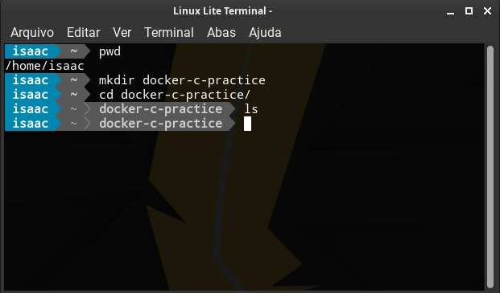
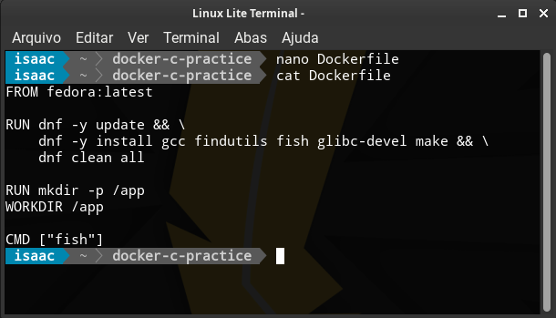
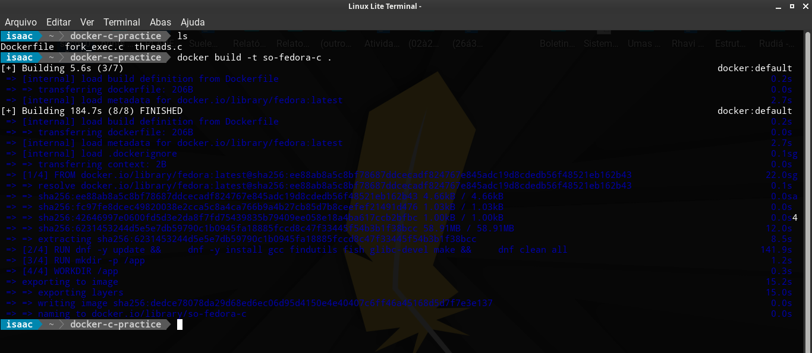
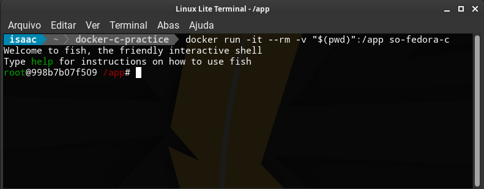
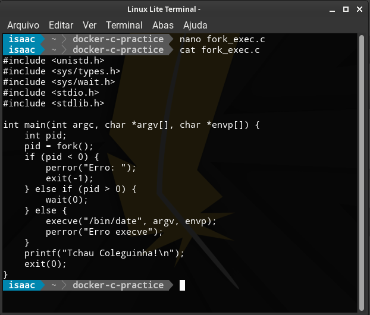
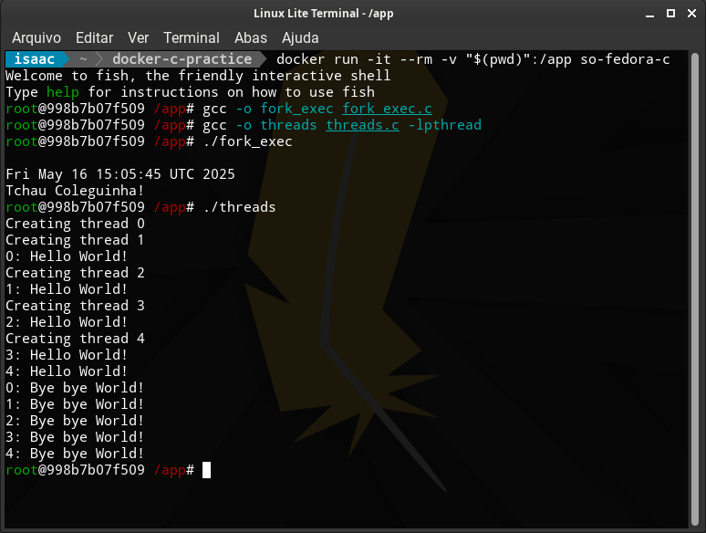

# Relatório - S.O. 2025.1 - Atividade 03 - Compilação de código dentro de docker fedora

**Nome:** Isaac  
**Data:** 16/05/2025  

---

## 1. Objetivo

O objetivo da prática foi utilizar o Docker com a imagem Fedora para compilar e executar códigos em linguagem C dentro de um ambiente isolado. Os programas utilizados implementam conceitos de processos e threads, baseados no capítulo 5 do livro-texto da disciplina de Sistemas Operacionais.

---

## 2. Passos Executados

### 2.1. Organização inicial do projeto

- Criei a pasta `docker-c-practice`.
- Dentro dela, adicionei os arquivos `Dockerfile`, `fork_exec.c` e `threads.c`.
- Criei também a subpasta `img/` para armazenar os prints de tela.

📸 **Print da pasta do projeto:**



---

### 2.2. Criação do Dockerfile

- O arquivo `Dockerfile` foi criado com base nas instruções fornecidas.
- A imagem base utilizada foi `fedora:latest`, e instalei os pacotes `gcc`, `fish`, `make`, etc.

📸 **Print da criação do Dockerfile:**



---

### 2.3. Construção da imagem Docker

- Comando utilizado:
```bash
docker build -t so-fedora-c .
````

📸 **Print da construção da imagem:**



---

### 2.4. Execução do container

* Comando utilizado no Linux:

```bash
docker run -it --rm -v "$(pwd)":/app so-fedora-c
```

📸 **Print da execução do container:**



---

### 2.5. Compilação e execução dos programas

#### fork\_exec.c

* Comando:

```bash
gcc -o fork_exec fork_exec.c
./fork_exec
```

📸 **Execução do fork\_exec.c:**



---

#### threads.c

* Comando:

```bash
gcc -o threads threads.c -lpthread
./threads
```

📸 **Execução do threads.c:**


---

📸 **Print da compilação e execução dos dois programas:**



---

## 3. Resultados Obtidos

* O código `fork_exec.c` criou um processo filho, executou o comando `date` via `execve`, e imprimiu “Tchau!” após a finalização.
* O código `threads.c` criou 5 threads que imprimiram mensagens antes e depois de `sleep(5)`.
* Tudo foi executado corretamente dentro do container Fedora.

---

## 4. Conclusão

A prática foi essencial para consolidar o uso de containers como ambiente de desenvolvimento isolado e portátil. Aprendi como preparar uma imagem personalizada com Fedora, como compilar e executar códigos em C dentro do container, e reforcei os conceitos de processos e threads descritos no capítulo 5 do livro-texto.
